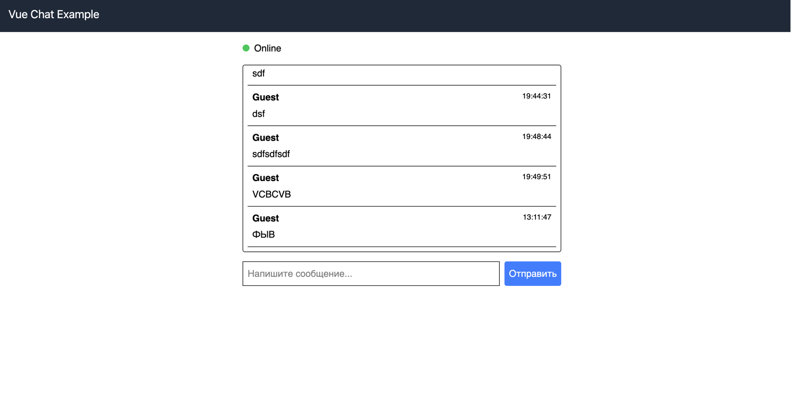

# Chat

**Chat** — это простое приложение онлайн-чата, реализованное с использованием [Vue.js 3](https://vuejs.org/), [Tailwind CSS](https://tailwindcss.com/) и WebSocket. Проект был разработан как тестовое задание для позиции Senior Frontend разработчика с использованием Vue.js и демонстрирует работу с реальным временем, хранением данных в локальном хранилище, адаптивным интерфейсом и чистой архитектурой кода.

## Особенности

- **Реальное время:** Мгновенный обмен сообщениями между пользователями через WebSocket.
- **Автопрокрутка:** Чат автоматически прокручивается к последнему сообщению при его появлении.
- **Индикация состояния подключения:** Отображение статуса подключения (например, предупреждение при разрыве соединения).
- **Локальное хранение:** Сохранение истории сообщений в локальном хранилище для восстановления при перезагрузке страницы.
- **Адаптивный дизайн:** Интерфейс оптимизирован для различных устройств и экранов.
- **Дополнительные возможности (опционально):**
  - Отправка сообщений по нажатию клавиши Enter.
  - Выбор никнейма перед началом чата.
  - Уведомления о подключении/отключении других пользователей.

## Используемые технологии

- **[Vue.js 3](https://vuejs.org/):** Фреймворк для создания интерфейсов.
- **[Tailwind CSS](https://tailwindcss.com/):** Утилитарный CSS-фреймворк для быстрой стилизации.
- **WebSocket:** Технология для обмена сообщениями в реальном времени.
- **Vue Router:** Клиентский роутинг для навигации между страницами.
- **Vuex / Pinia:** Управление состоянием приложения.
- **Инструменты разработки:**
  - [Vue CLI](https://cli.vuejs.org/) — для создания и настройки проекта.
  - PostCSS — для обработки CSS с Tailwind.

## Установка и запуск

### Предварительные требования

- **Node.js** (версия 12 или выше)
- **npm** (входит в состав Node.js)

### Шаг 1. Клонирование репозитория и установка зависимостей

```bash
git clone https://github.com/fullstackkk/chat.git
cd chat
npm install
```


### Запуск приложения в режиме разработки
```
npm run serve
```

### Сборка для продакшена
```
npm run build
```

### Линтинг и автоматическое исправление кода
```
npm run lint
```

### Структура проекта
chat/
├── public/                  # Статические файлы и index.html
├── src/
│   ├── assets/              # Стили (например, файл с директивами Tailwind CSS)
│   ├── components/          # Компоненты Vue (например, ChatMessage.vue)
│   ├── views/               # Представления (например, ChatView.vue)
│   ├── router/              # Конфигурация Vue Router
│   ├── store/               # Конфигурация Vuex/Pinia (если используется)
│   ├── App.vue              # Главный компонент приложения
│   └── main.js              # Точка входа приложения
├── babel.config.js          # Конфигурация Babel
├── jsconfig.json            # Конфигурация для редакторов (например, VSCode)
├── package.json             # Метаданные проекта и список зависимостей
├── postcss.config.js        # Конфигурация PostCSS (с Tailwind CSS)
├── tailwind.config.js       # Конфигурация Tailwind CSS
└── vue.config.js            # Конфигурация Vue CLI
